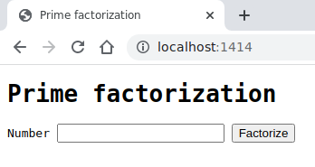
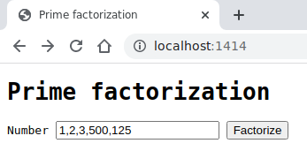
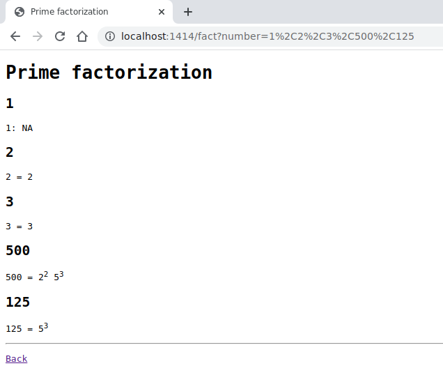

# **Proyecto 1**

## Avance 1

## **Descripción del problema**

Este proyecto tiene como problema principal **desarrollar un servidor web concurrente** y distribuido que permita a sus visitantes obtener la **factorización prima de números** mediante una aplicación web.

Se trabaja con una base de código existente de un servidor web serial que permite realizar una consulta generada por el usuario la cual es administrada de inicio a fin por un solo hilo, el hilo principal; éste servidor es el que se debe modificar para que realice la entrega de consultas de manera concurrente, siendo uno o más de un hilo el encargado de poner en cola de producción las consultas generadas por el usuario.

El fin de la aplicación web es que sea orientada a objetos y pueda responder con la factorización de números positivos menores que 2^63 de manera **serial**.

### **Características del programa:**

- **Lenguaje de programación utilizado:** C++.
- **Comunicación con el usuario:** mediante la terminal y navegador web.
- **Valores válidos:** números positivos menores que 2^63 (9223372036854775808).
- **Valores especiales:** 0 y 1.
- **Responde ante valores inválidos:** sí.
- **Forma de factorizar:** serial.
- **Patrón de concurrencia del servidor:** productor-consumidor.
- **Patrón de la aplicación web:** modelo-vista-controlador (MVC).

### **Requerimientos:**

- **Recibir una lista de enteros** separados por comas tanto por el URI (barra de direcciones del navegador) como el formulario web.
- **Paralelizar el envío de unidades** (consultas del usuario) vinculadas con sockets hacia la cadena de consumo, en términos de patrón productor-consumidor.
- **Calcular la factorización prima** de los números compuestos mediante la aplicación web.
- **Mostrar por la interfaz del navegador una lista con los números y sus factores primos.** Considera el caso de ser compuesto, en los demás casos puede que  incluyendo un mensaje de error para los valores no válidos o especiales en el orden en que fueron ingresados.

---

## **Manual de uso**

### **Compilación:**

Utilice el siguiente comando: `make`  
Ejemplo:

~~~bash
[usr:Proyecto01]$ make
mkdir -p build/prodcons/
g++ -c -Wall -Wextra -pthread -DWEBSERVER -g -std=gnu++11 -Isrc -Isrc/prodcons -Isrc/network -Isrc/http -Isrc/common -Isrc/webapp -Isrc/factapp -MMD src/prodcons/Semaphore.cpp -o build/prodcons/Semaphore.o
g++ -c -Wall -Wextra -pthread -DWEBSERVER -g -std=gnu++11 -Isrc -Isrc/prodcons -Isrc/network -Isrc/http -Isrc/common -Isrc/webapp -Isrc/factapp -MMD src/prodcons/Thread.cpp -o build/prodcons/Thread.o
mkdir -p build/network/
g++ -c -Wall -Wextra -pthread -DWEBSERVER -g -std=gnu++11 -Isrc -Isrc/prodcons -Isrc/network -Isrc/http -Isrc/common -Isrc/webapp -Isrc/factapp -MMD src/network/NetworkAddress.cpp -o build/network/NetworkAddress.o
g++ -c -Wall -Wextra -pthread -DWEBSERVER -g -std=gnu++11 -Isrc -Isrc/prodcons -Isrc/network -Isrc/http -Isrc/common -Isrc/webapp -Isrc/factapp -MMD src/network/Socket.cpp -o build/network/Socket.o
g++ -c -Wall -Wextra -pthread -DWEBSERVER -g -std=gnu++11 -Isrc -Isrc/prodcons -Isrc/network -Isrc/http -Isrc/common -Isrc/webapp -Isrc/factapp -MMD src/network/TcpClient.cpp -o build/network/TcpClient.o
g++ -c -Wall -Wextra -pthread -DWEBSERVER -g -std=gnu++11 -Isrc -Isrc/prodcons -Isrc/network -Isrc/http -Isrc/common -Isrc/webapp -Isrc/factapp -MMD src/network/TcpServer.cpp -o build/network/TcpServer.o
mkdir -p build/http/
g++ -c -Wall -Wextra -pthread -DWEBSERVER -g -std=gnu++11 -Isrc -Isrc/prodcons -Isrc/network -Isrc/http -Isrc/common -Isrc/webapp -Isrc/factapp -MMD src/http/HttpApp.cpp -o build/http/HttpApp.o
g++ -c -Wall -Wextra -pthread -DWEBSERVER -g -std=gnu++11 -Isrc -Isrc/prodcons -Isrc/network -Isrc/http -Isrc/common -Isrc/webapp -Isrc/factapp -MMD src/http/HttpConnectionHandler.cpp -o build/http/HttpConnectionHandler.o
g++ -c -Wall -Wextra -pthread -DWEBSERVER -g -std=gnu++11 -Isrc -Isrc/prodcons -Isrc/network -Isrc/http -Isrc/common -Isrc/webapp -Isrc/factapp -MMD src/http/HttpMessage.cpp -o build/http/HttpMessage.o
g++ -c -Wall -Wextra -pthread -DWEBSERVER -g -std=gnu++11 -Isrc -Isrc/prodcons -Isrc/network -Isrc/http -Isrc/common -Isrc/webapp -Isrc/factapp -MMD src/http/HttpRequest.cpp -o build/http/HttpRequest.o
g++ -c -Wall -Wextra -pthread -DWEBSERVER -g -std=gnu++11 -Isrc -Isrc/prodcons -Isrc/network -Isrc/http -Isrc/common -Isrc/webapp -Isrc/factapp -MMD src/http/HttpResponse.cpp -o build/http/HttpResponse.o
g++ -c -Wall -Wextra -pthread -DWEBSERVER -g -std=gnu++11 -Isrc -Isrc/prodcons -Isrc/network -Isrc/http -Isrc/common -Isrc/webapp -Isrc/factapp -MMD src/http/HttpServer.cpp -o build/http/HttpServer.o
mkdir -p build/common/
g++ -c -Wall -Wextra -pthread -DWEBSERVER -g -std=gnu++11 -Isrc -Isrc/prodcons -Isrc/network -Isrc/http -Isrc/common -Isrc/webapp -Isrc/factapp -MMD src/common/Log.cpp -o build/common/Log.o
g++ -c -Wall -Wextra -pthread -DWEBSERVER -g -std=gnu++11 -Isrc -Isrc/prodcons -Isrc/network -Isrc/http -Isrc/common -Isrc/webapp -Isrc/factapp -MMD src/common/Util.cpp -o build/common/Util.o
mkdir -p build/webapp/
g++ -c -Wall -Wextra -pthread -DWEBSERVER -g -std=gnu++11 -Isrc -Isrc/prodcons -Isrc/network -Isrc/http -Isrc/common -Isrc/webapp -Isrc/factapp -MMD src/webapp/FactWebApp.cpp -o build/webapp/FactWebApp.o
g++ -c -Wall -Wextra -pthread -DWEBSERVER -g -std=gnu++11 -Isrc -Isrc/prodcons -Isrc/network -Isrc/http -Isrc/common -Isrc/webapp -Isrc/factapp -MMD src/webapp/main.cpp -o build/webapp/main.o
mkdir -p build/factapp/
g++ -c -Wall -Wextra -pthread -DWEBSERVER -g -std=gnu++11 -Isrc -Isrc/prodcons -Isrc/network -Isrc/http -Isrc/common -Isrc/webapp -Isrc/factapp -MMD src/factapp/mathmatician.cpp -o build/factapp/mathmatician.o
mkdir -p bin/
g++ -Wall -Wextra -pthread -DWEBSERVER -g -Isrc -Isrc/prodcons -Isrc/network -Isrc/http -Isrc/common -Isrc/webapp -Isrc/factapp build/prodcons/Semaphore.o build/prodcons/Thread.o build/network/NetworkAddress.o build/network/Socket.o build/network/TcpClient.o build/network/TcpServer.o build/http/HttpApp.o build/http/HttpConnectionHandler.o build/http/HttpMessage.o build/http/HttpRequest.o build/http/HttpResponse.o build/http/HttpServer.o build/common/Log.o build/common/Util.o build/webapp/FactWebApp.o build/webapp/main.o build/factapp/mathmatician.o -o bin/Proyecto01 
[usr:Proyecto01]$
~~~

### **Ejecución interactiva:**  

Utilice el siguiente comando junto al número de puerto deseado (mayor a 1024) y cantidad de conexiones máximas permitidas por el servidor web separadas por un espacio en blanco por ejemplo: `bin/Proyecto01 1414 5`.  
El programa estará ahora ejecutándose a la espera del ingreso de datos mediante el navegador web ya sea por el URI o por el formulario.

~~~bash
[usr:Proyecto01]
$ bin/Proyecto01 1414 5
Info    webserver       Listening on 0.0.0.0 port 1414
~~~

Nota: En caso de no ingresar un número, el programa tomará como puerto por defecto el 8080 y la cantidad disponible de CPUs como cantidad de conexiones por defecto para realizar la concurrencia del servidor web.

Para **conectarse al servidor** basta con abrir un navegador y escribir en el URI: localhost:#puerto. Por ejemplo:  

#### **Ingreso de datos**

Ahora introduzca cada valor (entero positivo con rango: menor que 2^63) seguido de una coma `,` en el URI o en el formulario web para realizar su debida factorización prima.  

**Por formulario web**  
Puede ingresar los valores separados por coma seguidos de un `Enter` o pulsando el botón `Factorize`. Por ejemplo:  

**Por URI**  
Puede ingresar la palabra `fact` seguida de los valores separados por coma. Por ejemplo:  

### **Resultados**

Los resultados son mostrados por el navegador web de la siguiente manera:  

Estando desplegados los números digitados y su debida factorización, puede volver a insertar más números de las dos formas anteriores. Si por el contrario desea finalizar el programa entonces siga hacia la siguiente sección.

### **Finalización del programa:**

Hay dos formas de finalizar el programa:

- **Presionando Ctrl+C**  
  
En la terminal donde ejecutó el programa mantenga presionada la tecla `Ctrl` y pulse la tecla `C`, esto terminará el servidor adecuadamente, reaccionando con una señal. Por ejemplo:  

~~~bash
[usr:Proyecto01]
$ bin/Proyecto01 1414 5
Info    webserver       Listening on 0.0.0.0 port 1414
Info    connection      connection established with client 127.0.0.1 port 43466
Info    request GET /fact/100,526,9 HTTP/1.1
Info    socket  connection -----closed127.0.0.1 port 43466
^C
Caught signal 2 coming out...
[usr:Proyecto01]
$ 
~~~

- **Acabando el proceso con kill**  

**En una nueva terminal**, ingrese el comando `ps -eu` para visualizar los procesos activos, obtenga el proceso (**PID**, Process ID). Por ejemplo:

~~~bash
[usr:Proyecto01]
$ ps -eu
USER         PID %CPU %MEM    VSZ   RSS TTY      STAT START   TIME COMMAND
usr      2361  0.0  0.0   7232  3780 pts/0    Ss   17:55   0:00 /usr/bin/bash LANGUAGE=es_CR:es USER=usr X
usr      5754  0.0  0.1 112620  5992 pts/0    Sl+  18:38   0:00 bin/Proyecto01 1414 5 SHELL=/bin/bash SESSION
usr      5819  0.0  0.0   7232  3968 pts/1    Ss   18:38   0:00 /usr/bin/bash LANGUAGE=es_CR:es USER=usr X
usr      5866  0.0  0.0   9700  3368 pts/1    R+   18:39   0:00 ps -eu SHELL=/bin/bash SESSION_MANAGER=local/
[usr:Proyecto01]
$ 
~~~

Ahora detenga el proceso con el comando `kill PID` donde `PID` se reemplaza por el número de proceso que obtuvo con `ps`, en este caso es el 5754 entonces:  

~~~bash
[usr:Proyecto01]
$ kill 5754
~~~

De esta manera terminará el servidor adecuadamente, reaccionando con una señal. Terminal inicial:  

~~~bash
[usr:Proyecto01]
$ bin/Proyecto01 1414 5
Info    webserver       Listening on 0.0.0.0 port 1414
Info    connection      connection established with client 127.0.0.1 port 43494
Info    request GET /fact/100,526,9 HTTP/1.1
Info    socket  connection -----closed127.0.0.1 port 43494

Caught signal 15 coming out...
[usr:Proyecto01]
$ 
~~~

## **Créditos**

**Autores:**

| Nombre                      | contacto                       |
| :---                        | :---                           |
| Zurisadai Granados Montoyo  | zurisadai.granados@ucr.ac.cr   |
| Maeva Murcia Melendez       | valery.murcia@ucr.ac.cr        |
| Fabián Orozco Chaves        | fabian.orozcochaves@ucr.ac.cr  |
| Ariel Solís Monge           | ariel.solismonge@ucr.ac.cr     |

Basado en código existente: **Red y servidor**  
Se modificó de manera que se alcanzaran los requerimentos del avance 01.

- **Autor:** Jeisson Hidalgo
- **Contacto:**  <jeisson.hidalgo@ucr.ac.cr>
- **Carpetas:** [http](./src/http/) | [common](./src/common/) | [network](./src/network/) | [webapp](./src/webapp/)
- [Ruta de descarga](http://129.146.240.51/concurrente/2021b/ejemplos/taskc/prod_cons_pattern/)

---

Otras rutas:  
[Diseño de la solución](./design/README.md)
