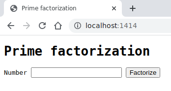
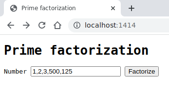
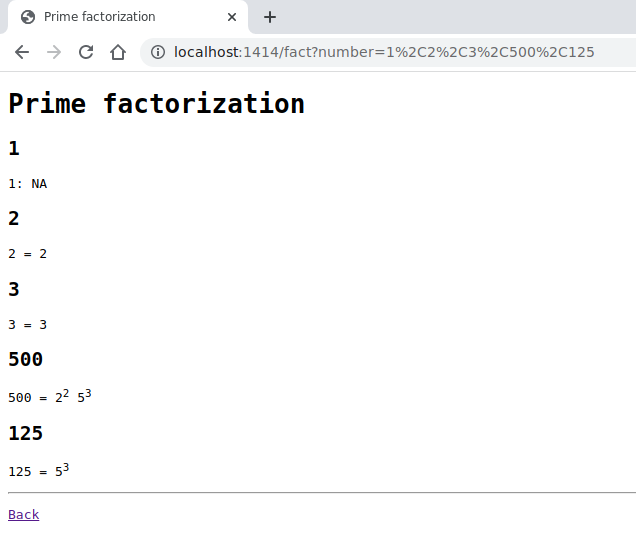
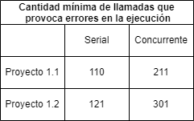

# **Proyecto 1**

## Avance 1

## **Descripción del problema**

Este proyecto tiene como problema principal **desarrollar un servidor web concurrente** y distribuido que permita a sus visitantes obtener la **factorización prima de números** mediante una aplicación web.

Se trabaja con una base de código existente de un servidor web serial que permite realizar una consulta generada por el usuario la cual es administrada de inicio a fin por un solo hilo, el hilo principal; éste servidor es el que se debe modificar para que realice la entrega de consultas de manera concurrente, siendo uno o más de un hilo el encargado de poner en cola de producción las consultas generadas por el usuario.

El fin de la aplicación web es que sea orientada a objetos y pueda responder con la factorización de números positivos menores que 2^63 de manera **concurrente**, de forma que la aplicación cree tantos hilos factorizadores como núcleos disponibles en la computadora para asi poder aumentar la eficiencia de la ejecución del programa.

### **Características del programa:**

- **Lenguaje de programación utilizado:** C++.
- **Comunicación con el usuario:** mediante la terminal y navegador web.
- **Valores válidos:** números positivos menores que 2^63 (9223372036854775808).
- **Valores especiales:** 0 y 1.
- **Responde ante valores inválidos:** sí.
- **Forma de factorizar:** Concurrente.
- **Patrón de concurrencia del servidor:** productor-consumidor.
- **Patrón de concurrencia de la aplicación:** productor-consumidor.
- **Patrón de la aplicación web:** modelo-vista-controlador (MVC).

### **Requerimientos:**

- **Recibir una lista de enteros** separados por comas tanto por el URI (barra de direcciones del navegador) como el formulario web.
- **Paralelizar el envío de unidades** (consultas del usuario) vinculadas con sockets hacia la cadena de consumo, en términos de patrón productor-consumidor.
- **Calcular la factorización prima** de los números compuestos mediante la aplicación web.
- **Mostrar por la interfaz del navegador una lista con los números y sus factores primos.** Considera el caso de ser compuesto, en los demás casos puede que  incluyendo un mensaje de error para los valores no válidos o especiales en el orden en que fueron ingresados.
- **Implementar el patron de productor-consumidor** En la aplicacion y en el packer, asi como crear los dispatcher necesarios para la correcta funcionalidad del programa.

---

## **Manual de uso**

### **Compilación:**

Utilice el siguiente comando: `make`  
Ejemplo:

~~~bash
[usr:Proyecto01]$ make
mkdir -p build/prodcons/
g++ -c -Wall -Wextra -pthread -DWEBSERVER -g -std=gnu++11 -Isrc -Isrc/prodcons -Isrc/network -Isrc/http -Isrc/common -Isrc/webapp -Isrc/factapp -MMD src/prodcons/Semaphore.cpp -o build/prodcons/Semaphore.o
g++ -c -Wall -Wextra -pthread -DWEBSERVER -g -std=gnu++11 -Isrc -Isrc/prodcons -Isrc/network -Isrc/http -Isrc/common -Isrc/webapp -Isrc/factapp -MMD src/prodcons/Thread.cpp -o build/prodcons/Thread.o
mkdir -p build/network/
g++ -c -Wall -Wextra -pthread -DWEBSERVER -g -std=gnu++11 -Isrc -Isrc/prodcons -Isrc/network -Isrc/http -Isrc/common -Isrc/webapp -Isrc/factapp -MMD src/network/NetworkAddress.cpp -o build/network/NetworkAddress.o
g++ -c -Wall -Wextra -pthread -DWEBSERVER -g -std=gnu++11 -Isrc -Isrc/prodcons -Isrc/network -Isrc/http -Isrc/common -Isrc/webapp -Isrc/factapp -MMD src/network/Socket.cpp -o build/network/Socket.o
g++ -c -Wall -Wextra -pthread -DWEBSERVER -g -std=gnu++11 -Isrc -Isrc/prodcons -Isrc/network -Isrc/http -Isrc/common -Isrc/webapp -Isrc/factapp -MMD src/network/TcpClient.cpp -o build/network/TcpClient.o
g++ -c -Wall -Wextra -pthread -DWEBSERVER -g -std=gnu++11 -Isrc -Isrc/prodcons -Isrc/network -Isrc/http -Isrc/common -Isrc/webapp -Isrc/factapp -MMD src/network/TcpServer.cpp -o build/network/TcpServer.o
mkdir -p build/http/
g++ -c -Wall -Wextra -pthread -DWEBSERVER -g -std=gnu++11 -Isrc -Isrc/prodcons -Isrc/network -Isrc/http -Isrc/common -Isrc/webapp -Isrc/factapp -MMD src/http/HttpApp.cpp -o build/http/HttpApp.o
g++ -c -Wall -Wextra -pthread -DWEBSERVER -g -std=gnu++11 -Isrc -Isrc/prodcons -Isrc/network -Isrc/http -Isrc/common -Isrc/webapp -Isrc/factapp -MMD src/http/HttpConnectionHandler.cpp -o build/http/HttpConnectionHandler.o
g++ -c -Wall -Wextra -pthread -DWEBSERVER -g -std=gnu++11 -Isrc -Isrc/prodcons -Isrc/network -Isrc/http -Isrc/common -Isrc/webapp -Isrc/factapp -MMD src/http/HttpMessage.cpp -o build/http/HttpMessage.o
g++ -c -Wall -Wextra -pthread -DWEBSERVER -g -std=gnu++11 -Isrc -Isrc/prodcons -Isrc/network -Isrc/http -Isrc/common -Isrc/webapp -Isrc/factapp -MMD src/http/HttpRequest.cpp -o build/http/HttpRequest.o
g++ -c -Wall -Wextra -pthread -DWEBSERVER -g -std=gnu++11 -Isrc -Isrc/prodcons -Isrc/network -Isrc/http -Isrc/common -Isrc/webapp -Isrc/factapp -MMD src/http/HttpResponse.cpp -o build/http/HttpResponse.o
g++ -c -Wall -Wextra -pthread -DWEBSERVER -g -std=gnu++11 -Isrc -Isrc/prodcons -Isrc/network -Isrc/http -Isrc/common -Isrc/webapp -Isrc/factapp -MMD src/http/HttpServer.cpp -o build/http/HttpServer.o
mkdir -p build/common/
g++ -c -Wall -Wextra -pthread -DWEBSERVER -g -std=gnu++11 -Isrc -Isrc/prodcons -Isrc/network -Isrc/http -Isrc/common -Isrc/webapp -Isrc/factapp -MMD src/common/Log.cpp -o build/common/Log.o
g++ -c -Wall -Wextra -pthread -DWEBSERVER -g -std=gnu++11 -Isrc -Isrc/prodcons -Isrc/network -Isrc/http -Isrc/common -Isrc/webapp -Isrc/factapp -MMD src/common/Util.cpp -o build/common/Util.o
mkdir -p build/webapp/
g++ -c -Wall -Wextra -pthread -DWEBSERVER -g -std=gnu++11 -Isrc -Isrc/prodcons -Isrc/network -Isrc/http -Isrc/common -Isrc/webapp -Isrc/factapp -MMD src/webapp/FactWebApp.cpp -o build/webapp/FactWebApp.o
g++ -c -Wall -Wextra -pthread -DWEBSERVER -g -std=gnu++11 -Isrc -Isrc/prodcons -Isrc/network -Isrc/http -Isrc/common -Isrc/webapp -Isrc/factapp -MMD src/webapp/main.cpp -o build/webapp/main.o
mkdir -p build/factapp/
g++ -c -Wall -Wextra -pthread -DWEBSERVER -g -std=gnu++11 -Isrc -Isrc/prodcons -Isrc/network -Isrc/http -Isrc/common -Isrc/webapp -Isrc/factapp -MMD src/factapp/mathmatician.cpp -o build/factapp/mathmatician.o
mkdir -p bin/
g++ -Wall -Wextra -pthread -DWEBSERVER -g -Isrc -Isrc/prodcons -Isrc/network -Isrc/http -Isrc/common -Isrc/webapp -Isrc/factapp build/prodcons/Semaphore.o build/prodcons/Thread.o build/network/NetworkAddress.o build/network/Socket.o build/network/TcpClient.o build/network/TcpServer.o build/http/HttpApp.o build/http/HttpConnectionHandler.o build/http/HttpMessage.o build/http/HttpRequest.o build/http/HttpResponse.o build/http/HttpServer.o build/common/Log.o build/common/Util.o build/webapp/FactWebApp.o build/webapp/main.o build/factapp/mathmatician.o -o bin/Proyecto01 
[usr:Proyecto01]$
~~~

### **Ejecución interactiva:**  

Utilice el siguiente comando junto al número de puerto deseado (mayor a 1024) y cantidad de conexiones máximas permitidas por el servidor web separadas por un espacio en blanco por ejemplo: `bin/Proyecto01 1414 5`.  
El programa estará ahora ejecutándose a la espera del ingreso de datos mediante el navegador web ya sea por el URI o por el formulario.

~~~bash
[usr:Proyecto01]
$ bin/Proyecto01 1414 5
Info    webserver       Listening on 0.0.0.0 port 1414
~~~

Nota: En caso de no ingresar un número, el programa tomará como puerto por defecto el 8080 y la cantidad disponible de CPUs como cantidad de conexiones por defecto para realizar la concurrencia del servidor web.

Para **conectarse al servidor** basta con abrir un navegador y escribir en el URI: 'localhost:puerto'. Por ejemplo:  

#### **Ingreso de datos**

Ahora introduzca cada valor (entero positivo con rango: menor que 2^63) seguido de una coma `,` en el URI o en el formulario web para realizar su debida factorización prima.  

**Por formulario web**  
Puede ingresar los valores separados por coma seguidos de un `Enter` o pulsando el botón `Factorize`. Por ejemplo:  

**Por URI**  
Puede ingresar la palabra `fact` seguida de los valores separados por coma. Por ejemplo:  

### **Resultados**

Los resultados son mostrados por el navegador web de la siguiente manera:  

Estando desplegados los números digitados y su debida factorización, puede volver a insertar más números de las dos formas anteriores. Si por el contrario desea finalizar el programa entonces siga hacia la siguiente sección.

### **Finalización del programa:**

Hay dos formas de finalizar el programa:

- **Presionando Ctrl+C**  
  
En la terminal donde ejecutó el programa mantenga presionada la tecla `Ctrl` y pulse la tecla `C`, esto terminará el servidor adecuadamente, reaccionando con una señal. Por ejemplo:  

~~~bash
[usr:Proyecto01]
$ bin/Proyecto01 1414 5
Info    webserver       Listening on 0.0.0.0 port 1414
Info    connection      connection established with client 127.0.0.1 port 43466
Info    request GET /fact/100,526,9 HTTP/1.1
Info    socket  connection -----closed127.0.0.1 port 43466
^C
Caught signal 2 coming out...
[usr:Proyecto01]
$ 
~~~

- **Acabando el proceso con kill**  

**En una nueva terminal**, ingrese el comando `ps -eu` para visualizar los procesos activos, obtenga el proceso (**PID**, Process ID). Por ejemplo:

~~~bash
[usr:Proyecto01]
$ ps -eu
USER         PID %CPU %MEM    VSZ   RSS TTY      STAT START   TIME COMMAND
usr      2361  0.0  0.0   7232  3780 pts/0    Ss   17:55   0:00 /usr/bin/bash LANGUAGE=es_CR:es USER=usr X
usr      5754  0.0  0.1 112620  5992 pts/0    Sl+  18:38   0:00 bin/Proyecto01 1414 5 SHELL=/bin/bash SESSION
usr      5819  0.0  0.0   7232  3968 pts/1    Ss   18:38   0:00 /usr/bin/bash LANGUAGE=es_CR:es USER=usr X
usr      5866  0.0  0.0   9700  3368 pts/1    R+   18:39   0:00 ps -eu SHELL=/bin/bash SESSION_MANAGER=local/
[usr:Proyecto01]
$ 
~~~

Ahora detenga el proceso con el comando `kill PID` donde `PID` se reemplaza por el número de proceso que obtuvo con `ps`, en este caso es el 5754 entonces:  

~~~bash
[usr:Proyecto01]
$ kill 5754
~~~

De esta manera terminará el servidor adecuadamente, reaccionando con una señal. Terminal inicial:  

~~~bash
[usr:Proyecto01]
$ bin/Proyecto01 1414 5
Info    webserver       Listening on 0.0.0.0 port 1414
Info    connection      connection established with client 127.0.0.1 port 43494
Info    request GET /fact/100,526,9 HTTP/1.1
Info    socket  connection -----closed127.0.0.1 port 43494

Caught signal 15 coming out...
[usr:Proyecto01]
$ 
~~~

Para medir la concurrencia del servidor se utiliza la herramienta de software llamada 'Httperf', con la cuál se disponen de ciertos medidores y estadísticas al ejecutar una serie de pruebas con conexiones y request al servidor Web Concurrente.Se realizan dos pruebas de rendimiento de la concurrencia, primeramente se ejecuta usando solo una llamada permitida para que simule un estado serial del servidor, y una segunda prueba con cantidades de llamadas permitidas mayores que 1.

### Mediciones al servidor permitiendo solo una llamada

Primeramente el servidor se puso a correr en una terminal y en otra terminal se ejecutó el siguiente comando:

~~~bash
[usr:Proyecto01] httperf --server localhost --port 8080 --uri /fact?number=123 --num-conns 200 --rate 50 --num-call 3 --timeout 1
~~~

El cuál generó los siguientes resultados de Httperf

~~~bash
Total: connections 200 requests 200 replies 200 test-duration 3.981 s

Connection rate: 50.2 conn/s (19.9 ms/conn, <=1 concurrent connections)
Connection time [ms]: min 0.1 avg 0.3 max 1.2 median 0.5 stddev 0.1
Connection time [ms]: connect 0.0
Connection length [replies/conn]: 1.000

Request rate: 50.2 req/s (19.9 ms/req)
Request size [B]: 77.0

Reply rate [replies/s]: min 0.0 avg 0.0 max 0.0 stddev 0.0 (0 samples)
Reply time [ms]: response 0.3 transfer 0.0
Reply size [B]: header 103.0 content 265.0 footer 0.0 (total 368.0)
Reply status: 1xx=0 2xx=200 3xx=0 4xx=0 5xx=0

CPU time [s]: user 1.73 system 2.23 (user 43.5% system 55.9% total 99.4%)
Net I/O: 21.8 KB/s (0.2*10^6 bps)

Errors: total 0 client-timo 0 socket-timo 0 connrefused 0 connreset 0
Errors: fd-unavail 0 addrunavail 0 ftab-full 0 other 0
~~~

## **Analisis al servidor concurrente**

### **Pruebas de concurrencia**

Del cuál obtenemos varios datos, entre ellos desde la primer línea se ve que se crearon la misma cantidad de respuestas que de consultas lo que quiere decir que los resultados son positivos y sin errores hasta el momento. Una duración del test de 3.981 segundos que no aporta tanto como los datos anteriores. Se realizan 50.2 conexiones y consultas por segundo, casi 20ms por consulta.

El ultimo bloque confirma que sí, no hubieron errores. Dado que solo hay una conexión concurrente, es serializado.

### Mediciones al servidor permitiendo más de una llamada

Ahora para la versión concurrente se decide emplear una estrategia de fuerza bruta para buscar dónde está el punto de quiebre en dónde el número de llamadas permitidas hace que el servidor empiece a generar problemas. Se hacen incrementos de 100 llamadas, hasta llegar al punto donde tire error y luego ir de-escalando. Cuando se introduce 400 llamadas se genera el primer error, tal y como se ve en la siguiente salida de Httperf:

~~~bash
Total: connections 200 requests 118331 replies 118300 test-duration 5.099 s

Connection rate: 39.2 conn/s (25.5 ms/conn, <=61 concurrent connections)
Connection time [ms]: min 96.2 avg 911.6 max 1391.5 median 1028.5 stddev 377.5
Connection time [ms]: connect 0.1
Connection length [replies/conn]: 700.000

Request rate: 23206.7 req/s (0.0 ms/req)
Request size [B]: 77.0

Reply rate [replies/s]: min 23192.7 avg 23192.7 max 23192.7 stddev 0.0 (1 samples)
Reply time [ms]: response 1.3 transfer 0.0
Reply size [B]: header 103.0 content 265.0 footer 0.0 (total 368.0)
Reply status: 1xx=0 2xx=118300 3xx=0 4xx=0 5xx=0

CPU time [s]: user 0.32 system 2.32 (user 6.3% system 45.6% total 51.8%)
Net I/O: 10082.8 KB/s (82.6*10^6 bps)

Errors: total 31 client-timo 31 socket-timo 0 connrefused 0 connreset 0
Errors: fd-unavail 0 addrunavail 0 ftab-full 0 other 0
~~~

En este punto, el servidor empieza a generar errores a la hora de responder tantos llamados.

El punto de quiebre se encuentra en 300 llamadas

~~~bash
Total: connections 200 requests 60000 replies 60000 test-duration 4.518 s

Connection rate: 44.3 conn/s (22.6 ms/conn, <=30 concurrent connections)
Connection time [ms]: min 90.7 avg 385.2 max 619.3 median 388.5 stddev 157.5
Connection time [ms]: connect 0.1
Connection length [replies/conn]: 300.000

Request rate: 13279.0 req/s (0.1 ms/req)
Request size [B]: 77.0

Reply rate [replies/s]: min 0.0 avg 0.0 max 0.0 stddev 0.0 (0 samples)
Reply time [ms]: response 1.3 transfer 0.0
Reply size [B]: header 103.0 content 265.0 footer 0.0 (total 368.0)
Reply status: 1xx=0 2xx=60000 3xx=0 4xx=0 5xx=0

CPU time [s]: user 0.48 system 2.77 (user 10.7% system 61.4% total 72.1%)
Net I/O: 5770.7 KB/s (47.3*10^6 bps)

Errors: total 0 client-timo 0 socket-timo 0 connrefused 0 connreset 0
Errors: fd-unavail 0 addrunavail 0 ftab-full 0 other 0
~~~

Apartir de 300 empieza a generar errores, por lo que se usa 300 como el punto de quiebre. La anterior ejecución también muestra datos interesantes en esta versión se ve que hubieron hasta 30 conexiones concurrentes al mismo tiempo en un determinado momento. La cantidad de consultas por segundo se incremento de gran manera y la cantidad de conexiones por segundo también aumento. La duración total de la versión concurrente no fue muy distinta a la versión serializada por lo que es fácilmente apreciable el beneficio de la ejecución de los programas y sistemas de forma concurrente.

A continuación se verá una tabla para ver los puntos de quiebre tanto de la ejecución serializada como concurrente de una versión anterior del servidor y de la versión actual

De la anterior tabla se logra observar que aunque la versión concurrente ofrece una mejora frente a la versión serial, pese a permitir más llamadas, un factor muy importante para el rendimiento es la cantidad de hilos que se le puedan asignar. La versión actual representa una gran mejora a la anterior que solo implementaba una concurrencia a nivel del HttpConnectionHandler, ahora se tiene la creación de hilos factorizadores y de colas que permiten que el programa acepte conexiones y consultas sin tener que esperar a que el trabajo de otros termine.

## **Créditos**

**Autores:**

| Nombre                      | contacto                       |
| :---                        | :---                           |
| Zurisadai Granados Montoyo  | zurisadai.granados@ucr.ac.cr   |
| Maeva Murcia Melendez       | valery.murcia@ucr.ac.cr        |
| Fabián Orozco Chaves        | fabian.orozcochaves@ucr.ac.cr  |
| Ariel Solís Monge           | ariel.solismonge@ucr.ac.cr     |

Basado en código existente: **Red y servidor**  
Se modificó de manera que se alcanzaran los requerimentos del avance 01.

- **Autor:** Jeisson Hidalgo
- **Contacto:**  <jeisson.hidalgo@ucr.ac.cr>
- **Carpetas:** [http](./src/http/) | [common](./src/common/) | [network](./src/network/) | [webapp](./src/webapp/)
- [Ruta de descarga](http://129.146.240.51/concurrente/2021b/ejemplos/taskc/prod_cons_pattern/)

---

Otras rutas:  
[Diseño de la solución](./design/README.md)
